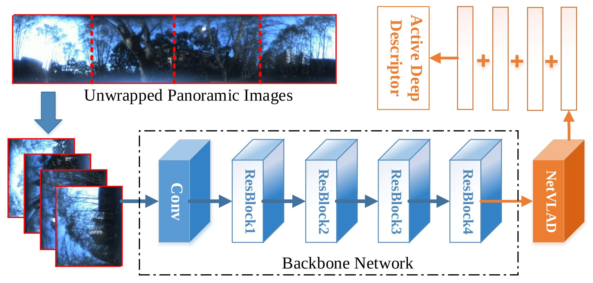

# Panoramic Scene Place Recognition

Visual localization is an attractive problem that estimates the camera localization from database images based on the query image. It is a crucial task for various applications, such as autonomous vehicles, assistive navigation and augmented reality. The challenging issues of the task lie in various appearance variations between query and database images, including illumination variations, dynamic object variations and viewpoint variations.

The code unifies Visual Localization and Scene Recognition based on Panoramic Images.

## Place Recognition
The place recognition algorithm using Panoramic Images and Active Descriptor is demonstrated in the following paper, where Panoramic Annular Localizer was proposed to tackle the variation challenges of place recognition.

Cheng, Ruiqi, et al. **Panoramic Annular Localizer: Tackling the Variation Challenges of Outdoor Localization Using Panoramic Annular Images and Active Deep Descriptors** [arXiv:1905.05425](https://arxiv.org/abs/1905.05425) 

 The panoramic annular images captured by the single camera are processed and fed into the NetVLAD network to form the active deep descriptor, and sequential matching is utilized to generate the localization result.



This code is adapted from Nanne's [pytorch-NetVlad](https://github.com/Nanne/pytorch-NetVlad). If you would like to get more information about NetVLAD, please refer to [arXiv:1511.07247](https://arxiv.org/abs/1511.07247).

Running `PlaceRecognitionMain.py` to extract descriptors and match queries with the database. The exemplar of test command is

```angular2
python PlaceRecognitionMain.py --dataset=Yuquan --resume=checkpoints_res \
--ckpt=latest  --numTrain=2 --cacheBatchSize=224 --threads=4 --fusion=add
```

Running `PlaceRecognitionTrain.py` to train descriptors using weakly supervised triplet ranking loss. The exemplar training command is in `train.sh`.

## Attentive Scene Place Recognition
 
Running `ScenePlaceRecognitionMain.py` to extract descriptors and match queries with the database. 